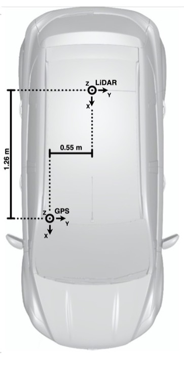
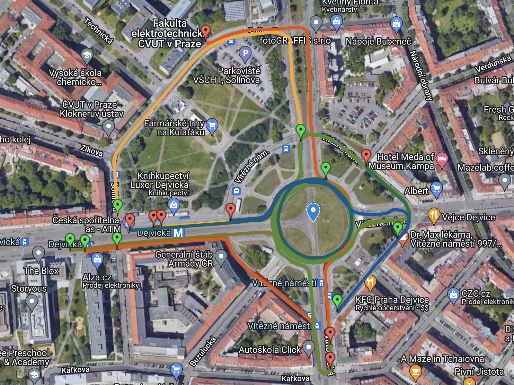
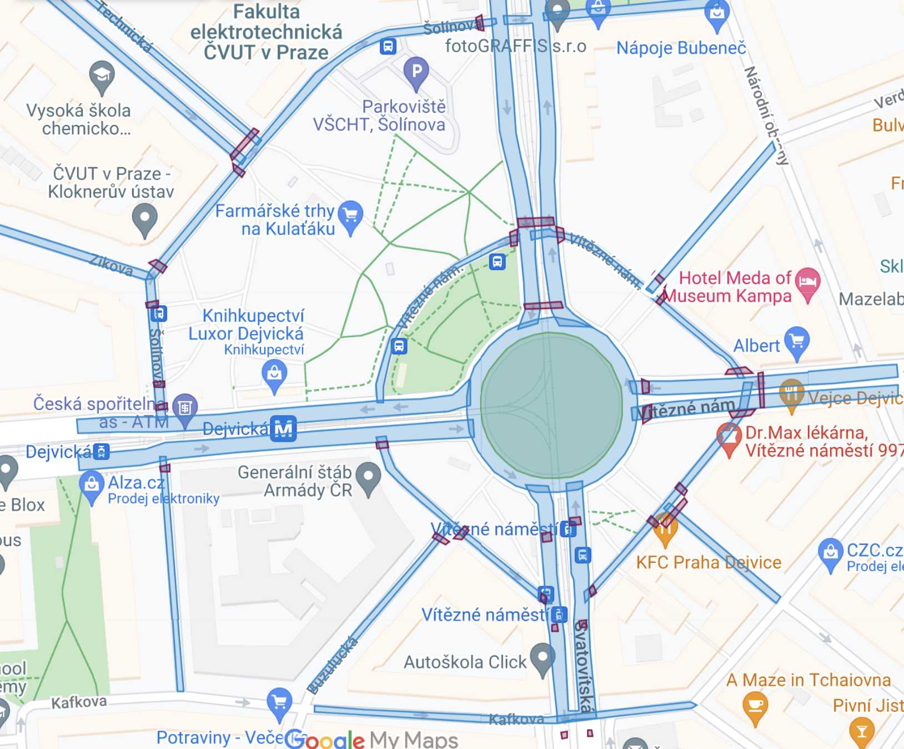
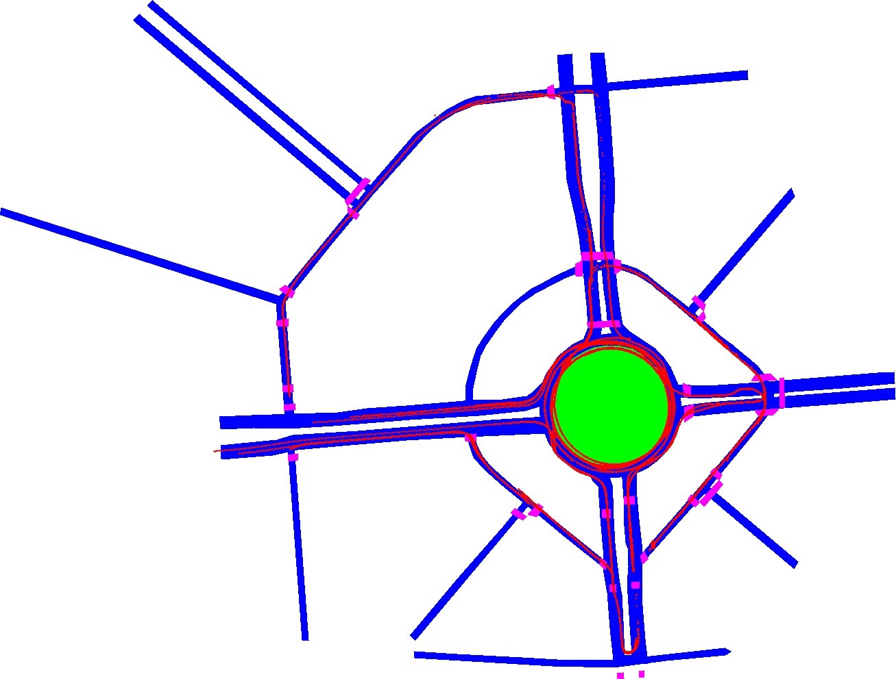

# Dataset Dejvice

Motivation for collecting the dataset was an idea to automate a labeling process. We captured Dejvice's roundabout area in different time. This allow us to create a HD map and split points into static and dynamic subset. Based on this division and localization in HD maps we can create the bounding boxes around the points and statistically decide about a class. 


## Setup 




For collecting the data was used Oyster lidar and gps (todo name)
```
Oyster lidar
- 10 Hz
- 128 lines and 45° field of view vertically

GPS
- NTRIP corrections (Geodetická stanice Ondřejov)
```

## Transformation

We transformed pointclouds from latitude and longtitude coordinates to xyz global coordinate system. The origin is placed into the center of the Dejvice's roundabout. See [code](maps/transformation.py) for HD maps. 

For pointclouds, we also used the heading information from GPS. Thus, we were able to rotate the pointcloud in a right direction. Additionally, we add the transformation from GPS to a center of the LiDAR ([gps2lidar.txt](data/gps2lidar.txt)).

<br clear="right"/>


## Description of the data

We captured 26563 frames, but only 18856 was available with accurate GPS. Dataset capture was divide into 9 sequnces. 
Visualization of sequences in Google map is available on [map link](https://www.google.com/maps/d/u/0/edit?mid=1KdB8-CveT3HbCh3U-pd8nBCAsRsPD6VV&usp=sharing).


### Overview


| seq_number | total frames | frames with accurate gps | color in map |
| ----- | ---- | ---- | ---- |
| seq_1 | 2178 | 1906 |  |
| seq_2 | 1866 | 1119 |  |
| seq_3 | 1905 | 1402 |  |
| seq_4 | 1946 | 1809 |  |
| seq_5 | 4762 | 3741 |  |
| seq_6 | 3983 |    0 | - |
| seq_7 | 7180 | 4011 |  |
| seq_8 | 5570 | 3762 |  |
| seq_9 | 1156 | 1106 |  |


### Dataset structure

```
data/
    pcl/
        01000001.npz
        01000002.npz
        01000003.npz
        ...
    poses/
        01000001.txt
        01000002.txt
        01000003.txt
        ...
  -README.md

```

# HD Map


### HD Map with trajectories and Google Maps with selection of Areas


<p float="left">
     
     
    
</p>

### Structure

```
maps/
    gpx_files/
        seq1.gpx
        ...
        seq9.gpx
    images/
    HD_maps_csv/
        HD_map_crosswalk.csv 
        HD_map_vegatable.csv 
        HD_map_side_streets.csv 
        HD_map_main_road.csv
        
```

#### CSV files

- HD_map_crosswalk.csv 
  - crosswalk, area with pedestriants on the road
- HD_map_vegatable.csv 
  - area with greenery (only center of the roundabout)
- HD_map_side_streets.csv 
    - road, which were captured during scanning
- HD_map_main_road.csv
    - road, which were captured during scanning and car drove on them


#### Legend in visualization: 
- Blue - road
- Green - vegetable
- Fialová - zebras


### Additional data


For 5 sequences was also captured mp4 video of front view.

In dataset_dejvice package is also provided class Annotator, which with help of HD maps can generate for each point .npz file label (class of point from HD map) and color (RGB info about the point for visualization)

<br clear="right"/>


## Online Repository link

On github are published only 10 frames from first sequence. Link for downloading all dataset -> link todo


## License

??? je potreba - templete: MIT License - see the [LICENSE.md](LICENSE.md) file for details


